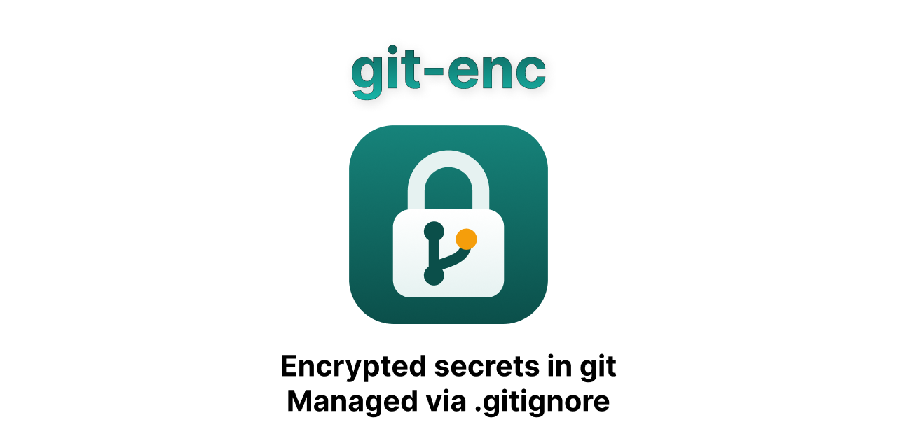

<h1 align="center"></h1>

<p align="center">
  <a href="https://github.com/shreeve/git-enc/actions/workflows/test.yml"></a>
  <a href="https://github.com/shreeve/git-enc/releases/latest"></a>
  <a href="LICENSE"></a>
</p>

Keep secrets in git, encrypted, and declare them where you already declare
what git should not track: `.gitignore`.

```gitignore
.DS_Store
*.log

# git-enc: team 3f9a1c2e
.env
config/secrets.yml
# git-enc: end
```

- **The plaintext can never be committed by accident.** Git ignores `.env`,
  whether or not anyone has git-enc installed.
- **An encrypted copy travels with the code.** Beside `.env`, git-enc keeps
  `.env.enc`, which is committed, pushed and pulled like any other file.
  Anyone with the key gets the plaintext; everyone else sees noise.
- **You decide when.** You encrypt your edits and take your team's changes
  when you choose to, and git-enc tells you which is which:

```console
$ git enc status
key team (3f9a1c2e): ok

Edited here (git enc add <file>):
  modified:  .env

Changed in git (git enc update):
  outdated:  config/secrets.yml

$ git enc add .env            # encrypt and stage .env.enc
$ git enc update              # bring config/secrets.yml up to date
$ git commit -m "Rotate the API key"
```

## Install

On macOS or Linux:

```sh
brew install shreeve/tap/git-enc
```

On Windows, download `git-enc.exe` from the
[latest release](https://github.com/shreeve/git-enc/releases/latest) and put
it on your PATH. With Go installed, this works anywhere:

```sh
go install github.com/shreeve/git-enc/cmd/git-enc@latest
```

git-enc is one self-contained program; git runs it as `git enc`. It needs
git 2.31 or later. Release archives come with sha256 checksums and GitHub
build attestations (`gh attestation verify FILE --repo shreeve/git-enc`).

## Get started

**In a repository that doesn't use it yet:**

```sh
git enc key new team            # create a key named "team"
git enc add --key team .env     # declare .env in .gitignore, encrypt it, stage .env.enc
git enc init                    # set up this clone (hooks and merging)
git commit -m "Encrypt .env"
```

Then share the key with your team **once**, through a password manager or
another private channel (`git enc key show team | pbcopy`), and **keep a copy
there yourself**: the key is the only way to decrypt your secrets.

If `.env` was already committed in plain text, `git enc add` stops tracking
it and warns you: old commits still hold the old value, so change that
secret.

**In a repository that already uses it**, or on a new machine:

```sh
git clone …
git enc key add team            # paste the key, then Ctrl-D
git enc init                    # set up this clone, and decrypt every secret you have a key for
```

Run `git enc init` once in every clone. On a new machine, nothing else is
lost with the old one except work you had not pushed, and that clone's
`git config enc.*` settings.

## Everyday use

| Command | What it does |
|---|---|
| `git enc status` | What you edited, what changed in git, what needs you |
| `git enc add FILE…` / `--all` | Encrypt your edits and stage the `.enc` files |
| `git enc update [FILE…]` | Bring your copies up to date; never loses an edit |
| `git enc diff [FILE…]` | Your edits against the committed version |
| `git enc merge [FILE…]` | Resolve a git merge or rebase conflict on a secret |
| `git enc check` | Quiet, for scripts: exit 3 if anything needs doing, 4 if only a key is missing |
| `git enc cat FILE` | Decrypt a `.enc` or a backup to the terminal |

Put `git enc check` in the script that starts your app (`bin/dev`, a
`predev` script, a Makefile), and a forgotten `git enc update` or
`git enc add` shows up exactly when it matters. `git enc help` lists every
command and flag; `-h` after any command works too.

### What each state means

| State | Meaning | Next step |
|---|---|---|
| `clean` | Your copy matches the committed version | — |
| `modified`, `new` | You edited it, or it isn't encrypted yet | `git enc add` |
| `outdated` | Someone committed a newer version | `git enc update` |
| `missing` | You have no plaintext yet, or its `.enc` was deleted | `git enc update` (restores whichever is gone) |
| `conflict` | You edited it, *and* it changed in git | `git enc update` |
| `diverged` | It matches no committed version, and git-enc can't tell why | `git enc update` |
| `merging` | Git has a merge or rebase conflict on the `.enc` | `git enc merge` |
| `no-key` | You don't have its block's key | `git enc key add NAME` |
| `orphaned` | No block lists it any more, but a file is still here | `git enc add --key NAME` to declare it again, or delete it |
| `corrupt` | The `.enc` is damaged or was encrypted for another path, or the plaintext can't be read | `git restore F.enc`, or fix the file's permissions |

`status` names the cause of a `no-key` more exactly, and
[Troubleshooting](#troubleshooting) says what to do about each.

## It never loses your work

- **`update` never overwrites an edit.** It replaces a copy only when git's
  history already holds that exact version. Otherwise it merges the new
  version into your edits, or, if you both changed the same lines, keeps
  your copy and puts the committed version in `F.incoming`. Merge what you
  need into `F` and `git enc add F` (until you change `F`, `add` refuses and
  `--all` skips it). `git enc update --discard F` takes the committed version
  instead.
- **`add` never overwrites a teammate's change.** It refuses an `outdated`,
  `conflict` or `diverged` secret, or a file still holding conflict markers,
  unless you pass `--force`.
- **Anything replaced is backed up first**, encrypted, in
  `.git/git-enc/backup/`: `git enc cat FILE > .env` puts one back.
- **Merges and rebases are handled.** After `git enc init`, git merges
  secrets by their plaintext, like any text file: edits to different lines
  merge inside `git pull` (then `git enc update` brings your copy up to
  date). Edits to the same line stop as a conflict, and `git enc merge`
  writes both sides into your file with the usual conflict markers. A merge
  that takes one side's `.enc` whole while both sides changed it (a "use
  mine" button) is refused at commit.

git-enc remembers, per clone, which committed version each of your copies
came from. That is how it tells *your edit* from *an outdated copy*, even
after a stash, reset, rebase or branch switch. If that record is lost, it
searches git history, and when it still can't tell, it says so (`diverged`)
instead of guessing.

## Hooks

`git enc init` installs hooks that **never encrypt anything, and decrypt only
when `enc.autoUpdate` is on** (it is by default under GitHub Desktop):

- **pre-commit** refuses to commit a secret's plaintext (after
  `git add -f .env`, say, or a plaintext copied over `.env.enc`), and reminds
  you of edits you haven't added.
- **pre-push** refuses to push commits that contain a secret's plaintext
  (one committed with `--no-verify`, say), and gives the same reminder.
- **post-checkout, post-merge, post-rewrite** remind you when secrets
  changed in git ("— run `git enc update`"). With `enc.autoUpdate` they bring
  them up to date instead, but only what needs no judgment: a copy git
  already holds, or a missing one.

Hooks you already had are kept and run after git-enc's. If `core.hooksPath`
is set (a hook manager, a global hooks folder), `init` leaves it alone and
tells you what to call from it. If the pre-commit check can't run at all, it
stops the commit and says why; `git commit --no-verify` skips it when you
are sure.

## Settings

Everything beyond encrypting, decrypting and refusing to commit plaintext
is optional, per clone, with `git config`:

| Setting | Default | What it does |
|---|---|---|
| `enc.autoUpdate` | off (on under Desktop) | Pulls and checkouts update secrets that need no judgment |
| `enc.requireAdded` | off (on under Desktop) | A commit stops while a secret is edited but not encrypted |
| `enc.skipKeys` | none | Blocks whose key you don't hold on purpose stay quiet |
| `enc.desktop` | on | `false`: under GitHub Desktop, the hooks behave as in a terminal |
| `enc.notify` | on | `false`: no system notifications under GitHub Desktop |
| `diff.git-enc.textconv` | unset | `"git-enc cat --textconv"`: `git diff` and `git log -p` show secrets decrypted |

Seeing secrets decrypted in every diff is off by default: it puts them on
screen, and in screen shares, whenever anyone looks at a diff. `git enc diff`
shows your own edits on demand. To have no hooks at all, don't run
`git enc init`, or delete the hooks it installed (each says it is safe to
delete).

## Keys and teams

A key is one line of text in `~/.config/git-enc/keys/NAME`, readable only by
you (git-enc refuses key files others can read). Keys are
[age](https://age-encryption.org) post-quantum keys. `git enc key add`
reads a key from standard input, never from the command line, where it would
end up in your shell history.

**Several groups.** Each `# git-enc:` block names one key, so several blocks
can keep secrets for different groups of people (`# git-enc: ops`). Each
block needs its own key. If you aren't in a group, say so once, and its
secrets stop asking for a key you'll never have:
`git config enc.skipKeys ops`.

**When someone leaves**, or a key may have leaked:

```sh
git enc key new team2           # the new key
git enc rekey team team2        # every "team" block now uses team2; re-encrypts and stages
git commit -m "Move secrets to key team2"
```

Give `team2` to the people who stay; until they import it, their secrets
show as `no-key`. `rekey` re-encrypts what is committed, never your working
copy, so edits you haven't added stay edits. Then **change the secrets
themselves**: anyone with the old key can still read every old version in
git history.

**Moving a secret to another block:** move its line into that block, run
`git enc rekey OLD NEW FILE` (for example `git enc rekey team ops
config/prod.env`), and commit.

**Stopping encrypting a secret:** delete its line from the block, `git rm`
its `.enc`, and commit. Keep the plaintext if you like: git-enc still keeps
it out of commits, and `status` lists it as `orphaned` until you delete it.

## Declaring secrets

`git enc add --key NAME FILE` writes the lines for you (the `--key` can be
left out once `.gitignore` has exactly one block). Inside a block, every line
is an ordinary `.gitignore` pattern:

```gitignore
# git-enc: team 3f9a1c2e
# .env in any directory (except ones git already ignores, like node_modules/),
# one exact path, and every .pem in certs/
.env
/config/secrets.yml
/certs/*.pem
# git-enc: end
```

- The header names the key and its fingerprint, so a different key that
  happens to have the same name is caught.
- Put comments on their own lines: `.gitignore` has no end-of-line comments
  (`.env  # note` is a pattern for a file literally named that).
- A block refuses patterns that would also hide the `.enc` files: whole
  directories (`secrets/`), patterns ending in `*` (`.env*`) or in `.enc`.
  Name the extension (`secrets/*.yml`) or list the files. It also refuses
  `**`, character classes like `[[:digit:]]`, and `!` rules. Git still
  ignores what a refused line matches, and the hooks still keep those files
  out of commits.
- Secrets can never be `.gitignore`, `.gitattributes`, `.gitmodules`, or
  anything inside `.git`, and git-enc never reads or writes through a
  symlink.

If a rule elsewhere in `.gitignore` also hides encrypted files (a common one
is `.env*`, which matches `.env.enc`), add `!*.enc` after it. Git applies the
last matching rule, so the `.enc` files become visible again:

```gitignore
.env*
!*.enc
```

That can't undo a rule that ignores a whole directory (`config/`), since git
never looks inside it; write `config/*` instead. Either way, `git enc status`
reports any encrypted file git would ignore.

## In CI

Hooks run on each person's machine, and anyone can skip them. `git enc
verify` is the check on the server's side. It needs no key, so it runs on
every pull request, forks included. It fails (exit 3) if a secret's
plaintext is committed, if a `.enc` isn't an encrypted file, or if
`.gitignore` has a problem. Given a range, it checks every commit in it too,
so plaintext committed and then deleted still fails:

```yaml
# .github/workflows/secrets.yml
name: secrets
on: pull_request
jobs:
  verify:
    runs-on: ubuntu-latest
    steps:
      - uses: actions/checkout@v4
        with:
          fetch-depth: 0              # the range needs the history
      - uses: actions/setup-go@v5
        with:
          go-version: stable
      - run: go install github.com/shreeve/git-enc/cmd/git-enc@latest
      - run: git enc verify "origin/${{ github.base_ref }}..HEAD"
```

To decrypt secrets in CI, put the keys in `GIT_ENC_KEY`, one per line, and
run `git enc update`. For blocks CI should not read:
`git -c enc.skipKeys=ops enc update`.

git-enc only guards the files you declare. To catch a key pasted into code,
add a secret scanner such as [gitleaks](https://github.com/gitleaks/gitleaks)
to the same workflow.

## GitHub Desktop

git-enc works with GitHub Desktop, once `git enc init` has run in the clone.
After `git enc add` (in a terminal), the `.enc` appears in Desktop's changes
like any other file, and you commit it there.

Desktop shows a hook's output only when the hook fails, in a dialog with
**Ignore and Continue** and **Abort**, and never shows what the hooks after a
pull or branch switch say. So when Desktop runs git, git-enc works with that:

- **Pulls and branch switches update your secrets**, except ones with your
  edits in them.
- **A pull that leaves a secret needing you is told at once**, in a system
  notification, once per problem.
- **Committing and pushing show one list of your secrets** in that dialog,
  when there is something to say:

  ```
  git-enc: this commit is stopped
   ✘ .env        edited, but not encrypted: Desktop can't see it until you add it
                 in a terminal: git enc add .env
   ! config.yml  you edited it, and it changed in git too
                 in a terminal: git enc update config.yml
   ✔ db.env      updated after the merge
  ```

  **✘** stops the commit, every time: an edit not encrypted (to commit
  without it: `git config enc.requireAdded false`), plaintext staged, a
  `.enc` that isn't encrypted, a merge that drops one side's change.
  **!** needs you, and is shown once; after that the commit goes ahead.
  **✔** is what git-enc did since the last list.

Two more things to know: Desktop shows `.enc` changes as binary files, and
when both of you changed the same line of a secret, it offers only "use
mine" or "use theirs". Either would drop a change, so the commit is refused
with the two commands that merge both sides.

## Security

**git-enc protects your secrets from anyone who can read the repository but
doesn't have the key**: a leaked or public repository, a fork, a CI cache,
GitHub itself.

- Every save is encrypted with fresh randomness, so a secret changed back to
  an earlier value gives a new, unrelated file.
- Secrets are padded: every secret up to about 200 bytes gives the same file
  size, and larger ones round up by at most about 12%.
- Each `.enc` records its own path, so a `.enc` copied over another secret's
  name is caught.
- `.gitignore` can't redirect a secret to another key: git-enc uses only a
  key whose name *and* fingerprint match the block, refuses two blocks that
  share a key, and re-encrypts under a new key only when you run
  `git enc rekey` and name both keys.

**It does not protect:**

- **History, from anyone who ever had the key.** Git keeps every version.
  When someone leaves, change keys **and change the secrets themselves**.
- **Metadata**: file names, roughly how big each secret is, when it changed,
  who changed it.
- **A compromised machine**, which holds both the key and the plaintext.
- **Who wrote a file.** Anyone with the key can write a valid `.enc`, and
  anyone who can push can commit an older one over a newer one (`update`
  warns when it would take a secret back to an earlier value). Review
  changes to `.enc` files and git-enc blocks as you would code.

**When not to use it**: production credentials, anything under an audit
regime (HIPAA, SOC 2), large teams, or teams with frequent turnover. Those
need per-person access, revocation and audit logs; use a secrets manager
(1Password, Doppler, Vault, a cloud KMS, SOPS). git-enc fits small, trusted
teams sharing development and staging secrets.

**No lock-in.** A `.enc` is a standard age file: `age -d -i KEYFILE F.enc`
(age 1.3 or later) opens it without git-enc. What comes out is a one-line
`git-enc` header, the secret, and zero padding; `git enc cat F.enc` gives
just the secret.

To report a security problem, see [SECURITY.md](SECURITY.md).

## Troubleshooting

**`status` says `diverged`.** git-enc lost track of where your copy came
from, and it matches no committed version, so it won't guess.
`git enc update F` keeps yours and puts the committed version in
`F.incoming`: merge what you need into `F`, then `git enc add F`.

**`no-key`.** You don't have the key its block needs: get it from whoever
shares it, then `git enc key add NAME`. If `status` says your key file is
unusable, fix what it names (usually `chmod 600`). If you have a *different*
key with that name, rename that file in `~/.config/git-enc/keys/` first. If
you aren't meant to have the key: `git config enc.skipKeys NAME`.

**CI exits 4.** `GIT_ENC_KEY` lacks a key a block needs; `git enc update`
names the secrets it skipped.

**"this clone is not set up".** Run `git enc init`: once per clone, and
again after upgrading git-enc.

**A commit or push is refused.** The message says why and what to run. If
it caught plaintext you committed but haven't pushed, the secret hasn't
left your machine: take it out of those commits (for the last one:
`git reset --soft HEAD~1`, then `git rm --cached F`), and there's no need to
change it. If it was pushed, change the secret.

**I want my old copy back.** Every plaintext git-enc replaced is in
`.git/git-enc/backup/`, newest last: `git enc cat .git/git-enc/backup/NAME > F`.

**Nobody has the key any more.** The versions in git can't be decrypted,
but your plaintext copies are fine. Start that block over: create a key
(`git enc key new NAME`), delete the block from `.gitignore`, `git rm` its
`.enc` files and commit, then `git enc add --key NAME FILE…`.

**Where does git-enc keep things?** The [reference](docs/reference.md) lists
every file it writes, its settings and environment variables (such as
`GIT_ENC_KEYS_DIR`), exit codes, and the JSON output for tools.

## Compared with other tools

- **git-crypt, transcrypt** decrypt files as git checks them out, so there
  is nothing to run. But a file is committed in plain text whenever the
  filter is missing (a new clone, an attribute added after the file),
  encryption is deterministic (a reverted secret is visibly the old file),
  lengths show, and there is no key rotation. git-enc makes plaintext
  impossible to commit by construction, pads, re-randomizes every save, and
  rotates keys; the cost is running `git enc add` and `git enc update`, which
  it reminds you to do.
- **SOPS** encrypts the values in YAML, JSON or .env files, so a reviewer
  sees which setting changed, gives each person or cloud key (KMS) its own
  access, and never writes a plaintext file. It is the better choice for
  production and larger teams. For development secrets an app reads from
  `.env`, SOPS users end up writing that file and keeping it current by
  hand; git-enc does that part, with any file type, and knows your edit from
  a teammate's change.
- **git-secret, BlackBox** give each person their own GPG key. git-enc's
  shared age key is simpler to run and to hand over, and weaker at revoking
  one person: that takes a new key for everyone.
- **git-secrets, gitleaks, trufflehog** find secrets pasted into code. They
  don't encrypt anything; use one alongside git-enc.

## Development

```sh
go test ./...                                   # unit tests, and end-to-end scenarios with real git
GIT_ENC_TEST_GIT=/path/to/git go test ./e2e/    # the same, with another git
python3 scripts/mutations.py                    # re-introduce each guarded bug; a test must catch every one
```

The end-to-end suite drives the real program against a shared origin and
several clones, each with its own keys. It runs in CI on macOS, Linux and
Windows.

## License

MIT
